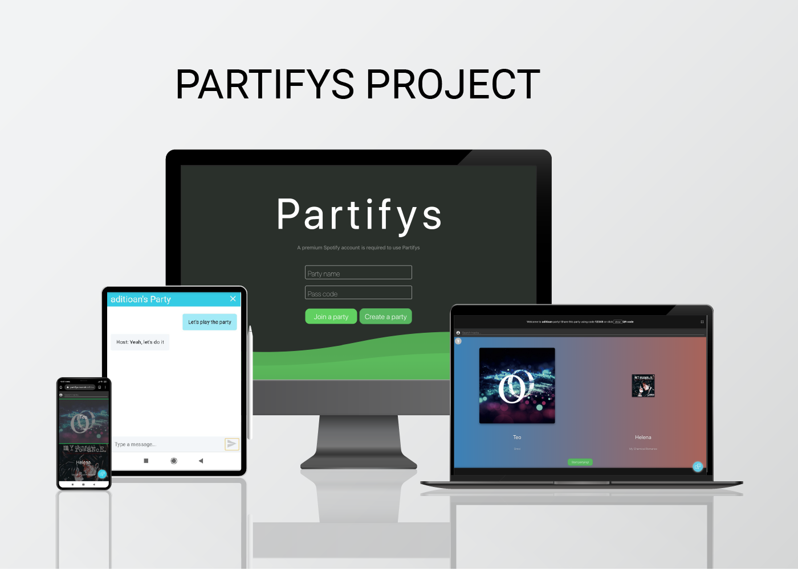

[](https://travis-ci.com/aditioan/partifys-frontend.svg?branch=master) [](https://standardjs.com) [](https://github.com/prettier/prettier)

# PARTIFYS PROJECT
#### [https://partifys.now.sh/](https://partifys.now.sh/)
Group project COMPSCI 732 Front-end repository 



## Members
1. Aditio Agung Nugroho (anug012 / 791804575)
2. Malith Patabandige (mpat901 / 6544754)
3. Senthil Kumaran Santhosh Gopal (sgop587 / 476621066)
4. Wei Lu (wlu702 / 778099429)


## Description
This project was created for the group project in the COMPSCI 732 course, at The University of Auckland. We utilize Spotify open API to create a website to host a “Party Playlist” using a Spotify premium account. The users must have a Spotify premium account to create the room. The frontend for the party spotify aplication was created using React + Redux + Redux-Saga + Styled Components and socket.io!


## Main Features
- Users can log in using their Spotify account (Premium account). 
- Users can create a “room” using name and code. 
- Users can share this room with friends using the party name + code or QR scan. 
- Users who enter the room can search and add songs to the room’s playlist. 
- Guests who enter the room can add a song and vote between two songs in the playlist to determine which one will be played next. 
- Users who have entered the room can chat with each other.

## Documentation
- [Project Meeting Minutes](https://share.nuclino.com/p/Partifys-Meeting-Minutes-Bronze-Bear-PDraCqJpRPWNCj8_Sdny3z)
- [Task Breakdown](https://share.nuclino.com/p/Task-Breakdown-Bronze-Bear-4ooamYE02NkzOKrF760y5d)
- [Partifys Tutorial](https://share.nuclino.com/p/Partifys-Tutorial-Bronze-Bear-T3vQlNFx-vqwT7_pyoEoao)

## Technologies
- [Reactjs](https://reactjs.org/)
- [Redux](https://redux.js.org/)
- [Styled Components](https://www.styled-components.com/)
- [Redux-Saga](https://redux-saga.js.org/)
- [Socket IO](https://socket.io/)

## Account for test
Use this account for testing purpose if you don't have spotify premium account. (Please be considerate while using this account)
```sh
username: uaditioa
passowrd: aditio1993
```

## How to run
```sh
# Create your environment file
cp .env.sample .env

# You can use our spotify client ID and environtment setting by default. 
# However, you can replace the placeholder values with your environment values (see next section)
nano .env.sample

# Install dependencies
npm install

# Run unit tests
npm test

# Run the project
npm start
```

## Creating the environment file

**Creating a Spotify application:**

- Create a "website" application on the [Spotify developer console](https://developer.spotify.com/dashboard/applications)
- Copy the client ID in your env file
- Save a `redirect_url` and copy it in your env file
